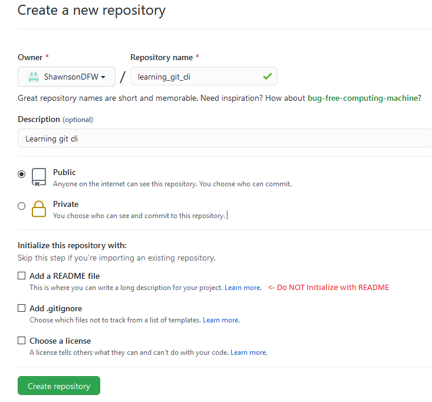

# **Basics of git lab 1 (not to be confused with GitLab)**


### Brief History

Git was created in 2005 as a replacement to an older proprietary version control system called BitKeeper that was used by the Linux kernel open source development community.  The relationship with the company that created BitKeeper and the Linux kernel development team broke down and the community decided to build their own that would be fast, distributed, simple, support non-linear development, and able to handle very large projects efficiently.

Git is mature, open source, born from the open source community, and has become the standard for source code version control in most software development globally.


### Setup and Config

There are a few things common things users do to customize a git installation.  These customizations include your identity, editor preferences, and default branch name.  They only have to be configured once per computer and will persist upgrades.


There are three places these configs are stored:

- **[path]/etc/gitconfig**

  - Settings in this location are applied by default to all users on the computer.  It is a system file and requires superuser privileges to access.

    

- **~/.gitconfig**

  - Settings in this location are applied by default to all git repositories created / maintained by the current user of the computer. 

  - Overrides variables of the same name at the system level

    

- **config** in the git repository directory

  - Settings in this location are applied only to the git repository that config file resides in.
  - Overrides variables of the same name at the system and user level


An example scenario of using configs from all level would be as follows:

- Setting default branch name at the system level.
- Setting user name, email address, and default editor at the user level
- Overriding default branch name for a particular repository.


##### **git config**

git config is used to easily view or edit the variables defined in the config files.

You can view all of your settings and where they are coming from using:

```console
git config --list
```


##### Update your identity

Updating your name and email address is required, or at least highly recommended.  They are are baked into every git commit.  The git client will nag at you until you do every time you stage changes to update the upstream repository.

```console
git config --global user.name "John Doe"
git config --global user.email johndoe@example.com
git config --list
```


### Creating Projects

#### Create a new git repository from git cli

Let's create a repository from the command line.  Open the terminal on your machine and type the following:

```console
cd ~/development/
git init learning_git_cli
```

This creates a directory named learning_git that contains a hidden configuration directory named .git (in Linux the . before a file or directory indicates it should be hidden.  This directory maintains state and configuration of your local repository.  You should rarely need to access the directory or files it contains, but you should be aware that it exists.  

We will not go into great detail on the purpose and function of .git configuration directory in this lab, but to learn more visit the official documentation site for the git open source project  https://git-scm.com/docs

Take a look at some of the at some of the contents and move back to repositories base directory.  Be sure to note the name at the end of the reference created in HEAD.  Most clients still default to "master" but nomenclature is slowly changing to "main" in git clients.  Also, note the variables listed in the config file.  The variables created does not represent all of the valid variables that can be configured for a project.

```
cd learning_git_cli/.git
ls -l
cat HEAD
cat config
cd ..
```


Validate that you are in the base directory using the present working directory command:

```
pwd
```


Create a barebones README markdown file

```
echo "# learning_git_cli" > README.md
```


View the contents of the the file.  (Hint:  It's just the heading in mark down)

```
cat README.md
```


#### **Create the upstream repository in GitHub**

Open a browser and login to github.com

Click the create new repository icon.


1. Name your repository learning_git_cli.

2. Add a description.

3. Choose whether or not to make it public or private.

4. Click the create repository button.

   




### Snapshotting

In "git speak" snapshotting is the basic workflow for staging content and committing it to your history.  For the purpose of this lab we are going to focus on a few of the snapshotting commands.


#### Snapshotting Commands

##### git add

The `git add` command adds content from the working directory into the staging area (or “index”) for the next commit. When the `git commit` command is run, by default it only looks at this staging area, so `git add` is used to craft what exactly you would like your next commit snapshot to look like.

Note: The --all or -A option for `git add` not only adds a specific file to the index (aka staging area), but also to remove any files that were removed from the local repository.  The --all flag is used so commonly that git has added an even shorter option "git add ." to save even more keyboard strokes when wanting to add or remove files to the index.


##### git status

The `git status` command will show you the different states of files in your working directory and staging area. Which files are modified and unstaged and which are staged but not yet committed. In its normal form, it also will show you some basic hints on how to move files between these stages.


##### git diff

The `git diff` command is used when you want to see differences between any two trees. This could be the difference between your working environment and your staging area (`git diff` by itself), between your staging area and your last commit (`git diff --staged`), or between two commits (`git diff master branchB`).


##### git commit

The `git commit` command takes all the file contents that have been staged with `git add` and records a new permanent snapshot in the database and then moves the branch pointer on the current branch up to it.  The -m (message) option is required for all commits.  It should be a short description of the changes being committed.


#### Push local repository to upstream

We've created a local repository named learning_git_cli with a single README.md file in previous steps.  Now it's time to push it upstream to github.  The first step is to add files to the staging area (aka index). 

Type the following into your terminal from within your local repo's base directory.

```
git add .
```


Now let's prepare to push changes tracked in the index to the upstream.

```
git commit -m "first commit"
```


Create a new branch named "main" in the repository.  This will update the HEAD file in our .git directory.  

```
git branch -m main
cat .git/HEAD
```

If your client still uses "master" as the default main branch, you will notice the reference has now changed to "main."


Define your remote upstream origin repository to the one we created in github previously.  Be sure to change add your github account name in the command below.

```
git remote add origin https://github.com/[AcctName]/learning_git_cli.git
cat .git/config
```

*You should notice your changes these commands have made to your local repositories config file vs the output from when we created the repo using the git init command above.*


Push your local repository to github to finish creating the repo.

```
git push -u origin main
```

When prompted, sign in to github with your credentials.  


Back in the browser, you should now see the README file and a single "main" branch in your learning_git_cli repository.


#### Add additional files to the project

Now let's make some updates to the project by adding a few files and uploading them to the remote repository. Run each of the following commands to create some new files:

```
echo "This is file 1." >> first_file.txt
echo "This is file 2." >> second_file.txt
echo "This is file 3." >> third_file.txt
echo "This is file 4." >> fourth_file.txt
echo "He's not very creative" >> fifth_file.txt
```


Now let's stage the changes (update the index) and push to our repository (based on the reference in our HEAD file)

```console
git add .
git commit -m "Here are some files!"
git push
```

Enter your creds if required.  View the changes to the github repository in your browser.


##### git status 

The command git status displays paths that have differences between the index file and the current HEAD commit, paths that have differences between the working tree and the index file, and paths in the working tree that are not tracked by Git.


Let's make some additional updates to the project by updating a file, creating a new directory, moving a file to that directory, and deleting an existing file.  Run each of the following commands:

```
echo "This still is file 1." >> first_file.txt
mkdir new_dir
mv third_file.txt new_dir/third_file.txt
rm fourth_file.txt
echo "This is file 4." >> fourth_file.txt
```


Get a listing of changes to files and directories are unstaged:

```
git status
```

*You will receive a message detailing the changes to tracked files and list of untracked files.*


Stage changes to commit and view the difference in the status message:

```
git add .
git status
```


Create commit and view the difference in the status message:

```
git commit -m "Changed a bunch of things"
git status
```

*Note that our branch is now ahead of origin/main*


##### git log

The git log command shows a history of commits and position of each commit in tree the distributed tree.  Output includes: commit author, author's email, commit timestamp, commit ID, commit message, and branch location.  Commits are listed in descending order based on timestamp.

The --oneline option for git log is handy if you want abbreviated single-line output containing:  commit ID, commit message, and branch location

Run the git log command:

```
git log
git log --oneline
```

*Note the branch location in parenthesis* 


Push changes to upstream and view the difference in the status message and git log output:

```
git push
git status
git log
```

*Nothing to commit and local and upstream commits are at the same version*


### Branching and Merging

Branching in source control is the diverging of new code (or documents or blobs) from the main code base of a project to continue development without affecting the main line.  


**git checkout**

The git checkout command is used to switch branches or restore working tree files.  It updates files in the working tree to match the version in the index or the specified tree.


Use the git checkout command to create a new branch in the local repository (working tree):

```
git checkout -b my_feature
cat .git/HEAD
```

*Notice the reference changed to my_feature*


Create a new file in the project and push changes upstream:

```console
echo "This is a new file" >> new_file.txt
git add .
git commit -m "First my_feature branch commit"
git push --set-upstream origin development
```


**git branch**

The git branch command is used to list, create, and delete branches.  If no options are added it will list branches and highlight the current branch in green and mark it with an asterisk.


Use the git branch command to view the branch list

```
git branch
```

*Notice the working directory is highlighted and marked with the asterisk*


Update the README.md file in the my_feature branch

```
echo "# learning_git_cli" > README.md
echo "- made another change in my_feature" >> README.md
```


Push to the remote repository

```
git add.
git commit -m "Ready for pull request"
git push
```

*Notice the working directory is highlighted and marked with the asterisk*


##### Fetch, Merge, and Pull

One of the most powerful aspects of git branch management is that allows projects to have many contributors working on different features at the same time while maintaining a stable main code base (if the proper testing and validation is in place).  However, many changes can occur to the parent branch between the time you begin development and the time you push your changes.

There are several functions in git that will allow sync between remote and local repositories to maintain state and prevent conflicts when working on a project with a team.

`git fetch` and `git merge origin/master` will  fetch & integrate remote changes.   Let me explain a common  scenario.  origin/master is at C.  Someone pushed D.  You worked on E  & F.  Note that you will not see D in your local repository until  you run `git fetch`.

```
   origin/master
    v
A-B-C-E-F < master
     \
     (D) < master on remote
```

Now you run `git fetch`.  Now you can see D, and origin/master is updated to match the remote repository that it's tracking.

```
A-B-C-E-F < master
     \
      D < origin/master, master on remote
```

Now you run `git merge`, giving you this:

```
A-B-C-E-F
     \   \
      D---G < master
      ^
    origin/master, master on remote
```

So now you've integrated your changes on master (E, F) with the new commits on origin/master (D).

`git pull` is simply a shortcut for the above steps.


**git fetch**

Fetch branches and/or tags (collectively, "refs") from one or more other repositories, along with the objects necessary to complete their histories.  It is a primary command used to download contents from a remote repository to update local repository to the state of a remote.


**git merge**

Incorporates changes from the named commits (since the time their histories diverged from the current branch) into the current branch.  This command is used by *git pull* to incorporate changes from another repository and can be used by hand to merge changes from one branch into another.


Example:

Assume the following history exists and the current branch is "`master`":

```
	  A---B---C topic
	 /
    D---E---F---G master
```

Then "`git merge topic`" will replay the changes made on the `topic` branch since it diverged from `master` (i.e., `E`) until its current commit (`C`) on top of `master`, and record the result in a new commit along with the names of the two parent commits and a log message from the user describing the changes.

```
	  A---B---C topic
	 /         \
    D---E---F---G---H master
```


**Warning**: Running *git merge* with non-trivial uncommitted changes is discouraged: while possible, it may leave you in a state that is hard to back out of in the case of a conflict.


**git stash**

Use `git stash` when you want to record the current state of the working directory and the index, but want to go back to a clean working directory.  The command saves your local modifications away and reverts the working directory to match the `HEAD` commit.  

Git stash basically allows you to hide and store your changes without having to commit them just yet.  These changes will follow you between branches and commits.  This could be useful if you need to merge in some upstream changes from master that may conflict with your work. 


**git pull**

git pull will fetch from and integrate with another repository or a local branch.  In its default mode, git pull is shorthand for git fetch followed by git merge FETCH_HEAD.

More precisely, git pull runs git fetch with the given parameters and calls \*git merge\* to merge the retrieved branch heads into the current branch.


#### Create a pull request


Click compare & pull request button

*Note there are no conflicts and the branches can be automatically merged.*


Write a comment and press the Create pull request button


Note: At this point continuous integration can kick in.

Click the merge pull request and confirm to complete the merge.


**Repository Clean Up**

In your github account click on the learning_git_cli link.

Click the settings link in the sub navigation menu.

Scroll all the way to the bottom to the Danger Zone

Click Delete this repository

Type the phrase requested and click I accept


